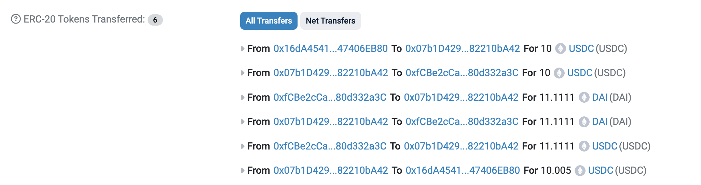

# Simple Flash Loan Arbitrage Code

This code is based on [this](https://github.com/jspruance/aave-flash-loan-tutorial) tutorial but I use Foundry instead of Hardhat for deployment and testing.



## Table of Contents
- [Needed Contracts](#needed-contracts)
- [Usage](#usage)
  - [Clone this repository](#clone-this-repository)
  - [Set up .env](#set-up-env)
  - [Deploy](#deploy)
  - [Add flashloan and dex into .env](#add-flashloan-and-dex-into-env)
  - [Send DAI & USDC to DEX contract](#send-dai--usdc-to-dex-contract)
  - [Approve](#approve)
  - [Execute the flash loan](#execute-the-flash-loan)

## Needed Contracts
- Sepolia DAI Contract: `0xFF34B3d4Aee8ddCd6F9AFFFB6Fe49bD371b8a357`
- Sepolia USDC Contract: `0x94a9D9AC8a22534E3FaCa9F4e7F2E2cf85d5E4C8`

# Usage 

## Clone this repository.

```bash
git clone https://github.com/Cyfrin/foundry-nft-f23
cd foundry-nft-f23
forge install
forge build
```

## Set up .env
```env
SEPOLIA_RPC_URL = 
PRIVATE_KEY = 
SEPOLIA_DAI = 
SEPOLIA_USDC = 
```

## Deploy
```bash
forge script script/DeployFlashLoan.s.sol:DeployFlashLoan --broadcast --rpc-url $SEPOLIA_RPC_URL --private-key $PRIVATE_KEY
```

## Add flashloan and dex into .env
```env
DEX_CONTRACT = 
FLASHLOAN_CONTRACT = 
```

## Send DAI & USDC to DEX contract

```bash
cast send $SEPOLIA_DAI "transfer(address,uint256)(bool)" $DEX_CONTRACT 100000000000000000000 --rpc-url $SEPOLIA_RPC_URL --private-key $PRIVATE_KEY
```
```bash
cast send $SEPOLIA_USDC "transfer(address,uint256)(bool)" $DEX_CONTRACT 100000000 --rpc-url $SEPOLIA_RPC_URL --private-key $PRIVATE_KEY
```

### Approve

```bash
cast send $FLASHLOAN_CONTRACT "approveUSDC(uint256)(bool)" 10000000 --rpc-url $SEPOLIA_RPC_URL --private-key $PRIVATE_KEY
```

```bash
cast send $YOUR_FLASHLOAN_CONTRACT "approveDAI(uint256)(bool)" 12000000000000000000 --rpc-url $SEPOLIA_RPC_URL --private-key $YOUR_PRIVATE_KEY
```

### Execute the flash loan
```bash
cast send $YOUR_FLASHLOAN_CONTRACT "requestFlashLoan(address,uint256)" $SEPOLIA_USDC_CONTRACT 10000000 --rpc-url $SEPOLIA_RPC_URL --private-key $PRIVATE_KEY
```

